# Welcome to the Agentic-Writer Wiki

   

**Agentic-Writer** is an intelligent AI agent system that automates the entire content creation lifecycle—from research to publication. Built with LangChain and powered by OpenAI's GPT models, it orchestrates specialized agents to research topics, write high-quality articles, curate images, and publish to multiple platforms.

---

## 📚 Documentation Hub

| 🚀 **Getting Started** | 📘 **Guides & Usage** | 🛠️ **Development** |
|:-------------------|:-------------------|:-------------------|
| [**Installation**](Installation.md) - Setup instructions | [**Usage Guide**](Usage-Guide.md) - How to use the CLI | [**Architecture**](Architecture.md) - System design |
| [**Quick Start**](Getting-Started.md) - First steps | [**Configuration**](Usage-Guide.md#configuration) - Env vars & settings | [**API Reference**](API-Reference.md) - Code documentation |
| [**FAQ**](FAQ.md) - Common questions | [**Troubleshooting**](Troubleshooting.md) - Fix common issues | [**Contributing**](Contributing.md) - How to help |
| | | [**Roadmap**](Roadmap.md) - Future plans |

---

## ✨ Key Features

### 🔍 Automated Research

- Intelligent web searches using DuckDuckGo
- Multi-source information gathering
- Topic analysis and synthesis
- Automatic retry with exponential backoff

### ✍️ AI-Powered Writing

- Well-structured articles (1200-1500 words)
- Multiple writing styles (professional, casual, technical)
- Markdown formatting
- Automatic metadata and tag generation

### 🖼️ Image Curation

- Contextual image search
- Unsplash API integration
- Diverse, high-quality image selection
- Automatic attribution

### 📤 Multi-Platform Publishing

- Local file system (Markdown + JSON)
- Medium integration (with API token)
- Extensible for additional platforms

## 🏗️ System Architecture

The system uses a sequential orchestrator pattern to manage specialized agents:

```mermaid
graph TD
    Start([Start]) --> Orch{Orchestrator}
    Orch --> Research[🔍 Research Agent]
    Research --> Writing[✍️ Writer Agent]
    Writing --> Images[🖼️ Image Agent]
    Images --> Publish[📤 Publisher Agent]
    Publish --> End([End])
```

*(See [Architecture](Architecture.md) for detailed diagrams)*

## 📊 Project Status

| Component | Status | Coverage |
|-----------|--------|----------|
| Research Agent | ✅ Complete | 100% |
| Writer Agent | ✅ Complete | 100% |
| Image Agent | ✅ Complete | 100% |
| Publisher Agent | ✅ Complete | 100% |
| CLI Interface | ✅ Complete | 100% |
| Tests | ✅ 16/16 Passing | High |

## 🎯 Use Cases

- **Content Marketing** - Generate blog posts and articles
- **Educational Content** - Create tutorials and learning materials
- **Research Summaries** - Synthesize complex topics
- **Technical Documentation** - Write guides and documentation
- **Newsletter Content** - Create engaging articles
- **Social Media** - Generate long-form content for platforms

## 🔧 Tech Stack

- **LangChain** - AI framework
- **OpenAI GPT** - Large language models
- **Click** - CLI framework
- **Rich** - Terminal UI
- **Pydantic** - Data validation
- **DuckDuckGo** - Web search
- **Unsplash** - Image API

## 📈 Performance

- **Research**: 10-30 seconds
- **Writing**: 30-60 seconds
- **Images**: 5-15 seconds
- **Publishing**: <5 seconds
- **Total Time**: 2-5 minutes typical

## 🤝 Community & Support

- **Found a bug?** [Open an issue](https://github.com/eggressive/agentic-writer/issues)
- **Have a question?** [Start a discussion](https://github.com/eggressive/agentic-writer/discussions)
- **Want to contribute?** Read our [Contributing Guide](Contributing.md)

## 📄 License

This project is licensed under the MIT License - see the [LICENSE](https://github.com/eggressive/agentic-writer/blob/main/LICENSE) file for details.

## 🙏 Acknowledgments

- Built with [LangChain](https://langchain.com/)
- Powered by [OpenAI](https://openai.com/)
- Images from [Unsplash](https://unsplash.com/)
- Search via [DuckDuckGo](https://duckduckgo.com/)

---

**Need Help?** Check out our [FAQ](FAQ.md) or [Troubleshooting](Troubleshooting.md) guides.
